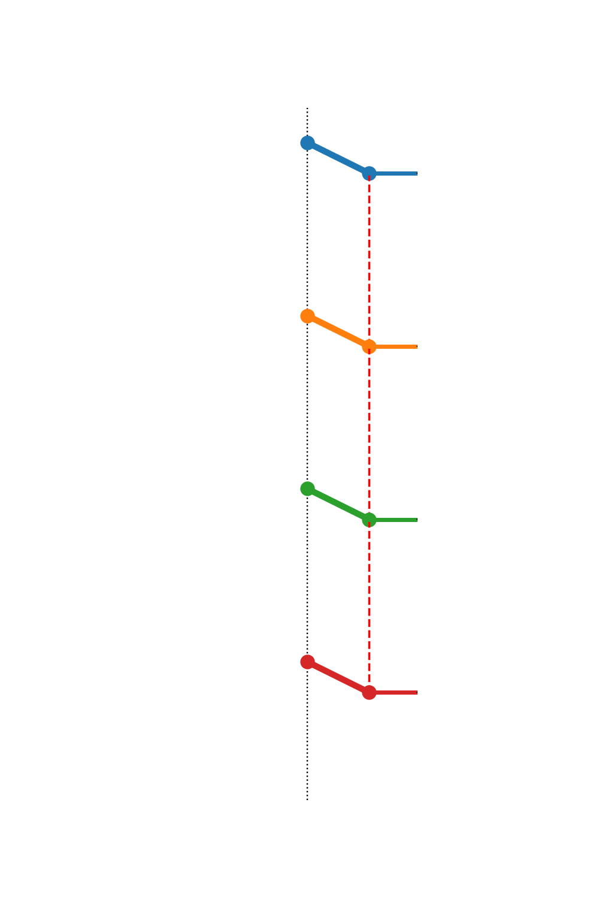

# Generating Informative Benchmarks for Reinforcement Learning

`publ2025-code-converse` contains **two demonstrations**, one of sensetivity testing, and the other of capabilities of problem generators.

## 📋 Overview
The first demonstration or experiment compares RAdam and Adam optimizers in reinforcement learning using converse optimality. The study employs dynamically generated control systems with multi-dimensional truncated Fourier series dynamics. System generation uses fixed seeds for reproducibility, while neural network initialization remains stochastic, enabling rigorous optimizer evaluation under controlled conditions.


# publ2025-code-converse  🛠️⚙️🎞️  

> Symbolic N-crank benchmark & RL controllers (PPO | A2C | SAC | Optimal | u=0)

<div align="center">

| PPO | A2C | SAC |Optimal|Uncontrolled|
|-----|-----|-----|----|----|
|  |  |  |  |  |

</div>


[▶ Jump to Experiment 2](#exp2)

## 🚀 Quick Start

### Installation
``` bash
git clone https://github.com/aidagroup/publ2025-code-converse.git
python3 -m venv rl_opt_env
source rl_opt_env/bin/activate  # Linux/MacOS
# or .\rl_opt_env\Scripts\activate for Windows

pip install -r requirements.txt
```
## 🔬 Experiment 1 Execution
To reproduce the experiments with fixed system generation seeds while allowing neural network weight initialization variability:

#### Run the full experiment (160 runs: 80 RAdam + 80 Adam)
```python3 main.py```

### Visualize results using TensorBoard
```
tensorboard --logdir=multi_opt_full_experiment/ --port 8888
# Extract the final values using 
python3 exstract_csvs.py # Change the URL to the new downloading link from tensorboard localhost
```


### Immedieatly Analyse our existing data
we already have saved all 160 CSVs in a file named "Combined_CSVs" and extract the final rewards then perform one of the latter tests.

#### Generate statistical analysis plots
```python tensorboard_boxplot.py  # Comparative performance distributions
python3 analysis_scripts/tensorboard_fscore.py   # F-test significance analysis
python3 analysis_scripts/tensorboard_hist.py     # Reward distribution histograms
python3 analysis_scripts/tensorboard_boxplot.py  # Comparative performance distributions
python3 analysis_scripts/Final_Rewards_Distribution_KDE.py # Generate the final reward distribution using a gaussian kernal

```
### Configuration Details
The PPO algorithm is configured with the following hyperparameters:

## Hyperparameters

The following hyperparameters were used for the PPO algorithm:

| Parameter         | Value      | Description                                                                 |
|-----------------|------------|-----------------------------------------------------------------------------|
| `optimizer_class` | Adam, RAdam | The optimizer used for training (Adam and RAdam were compared).           |
| `learning_rate` | 3e-4       | Learning rate for the optimizer.                                           |
| `n_steps`         | 2048       | Number of steps before updating the policy.                               |
| `batch_size`     | 64         | Batch size used during training.                                            |
| `n_epochs`        | 10         | Number of epochs per update.                                                |
| `gamma`           | 0.99       | Discount factor.                                                            |
| `gae_lambda`      | 0.95       | Lambda parameter for generalized advantage estimation.                     |
| `clip_range`      | 0.1        | Clipping range for the policy update.                                     |
| `ent_coef`        | 0.01       | Entropy coefficient for encouraging exploration.                           |
| `max_grad_norm`   | 0.3        | Maximum gradient norm for clipping gradients.                              |
| `net_arch`        | [64, 64]   | Neural network architecture for both policy and value function (hidden layers). |
| `features_dim`    | 128        | Dimensionality of features extracted from the input.                       |


### Neural Network Architecture

A custom multilayer perceptron (MLP) (`CustomMLP`) was used as the neural network architecture, with the hyperparameters defined above. The architecture remained consistent for both Adam and RAdam experiments, allowing for a fair comparison.
```
{
  "features_extractor": "CustomMLP(128)",  # State feature extraction
  "pi": [64, 64],  # Policy network layers
  "vf": [64, 64],  # Value function network layers
  "optimizer": ["RAdam", "Adam"]  # Optimizer variants
}
```
## 📊 Results 

The following figures summarize the results of the experiment:

* F-test plot comparing the distribution of rewards (please add description).
 
* Kernel Density Estimate (KDE) plot visualizing the reward distributions for Adam and RAdam.

* Box plot comparing the final rewards obtained using Adam and RAdam optimizers.
")
<a name="exp2"></a>
## Experiment 2 Details
### install new dependencies
```
pip install -r requirements2.txt   # extra deps
```

### Training all algorithms
```
python3 train_all_crank.py --run_both
```
### Training with different variables

The `train_all_crank.py` script accepts these flags:

```bash
  --algo {ppo,a2c,sac}             # which algorithm to train (default: ppo)
  --run_both                       # train PPO, A2C and SAC in sequence
  --timesteps TIMESTEPS           # total training timesteps (default: 2_000_000)
  --dt DT                          # integration timestep used for reward scaling (default: 0.01)
  --max_episode_steps STEPS       # max steps per episode (default: 700)
```
**Example**
```
python train_all_crank.py --algo a2c \
  --timesteps 500000 \
  --dt 0.005
```

### Evaluate (deploying) saved models
* Be aware if you train new model, you need to replace thier names in `eval_all_with_sim_cranks.py`
here:
```
    "ppo"         : (lambda: simulate_ppo(system, "crank_models/ppo_20250509_012547_dt_0.010", dt=0.01), PPO),
    "sac"         : (lambda: simulate_sac(system, "crank_models/sac_20250508_020749_dt_0.010", dt=0.01), SAC),
    "a2c"         : (lambda: simulate_a2c(system, "crank_models/a2c_20250509_022254_dt_0.010", dt=0.01), A2C),
```
* Evaluating the existing models
```
python3 eval_all_with_sim_cranks.py
```

#### **Comparison runs**  
   - **RL algorithms** like PPO on same plant  
   - **Uncontrolled** (u=0)  
   - **Optimal**  

#### **Outputs**  
   - `plots/ppo.gif`, `plots/uncontrolled.gif`, `plots/optimal.gif`  
   - CSVs: `plots/data/{label}_*.csv`  
   - Value‐function & stage‐cost time series plots  


### Changing the system / multiple systems
All physical parameters live in crank_system.py and are sampled by
gen_params(n_samples).

To train on K different plants:
```
for ps in gen_params(K):
    system = build_system(ps)
    ...  # call train_all_crank.py with --model_out crank_models/<tag>_<idx>.zip
```

## 📊 Results: Experiment 2

